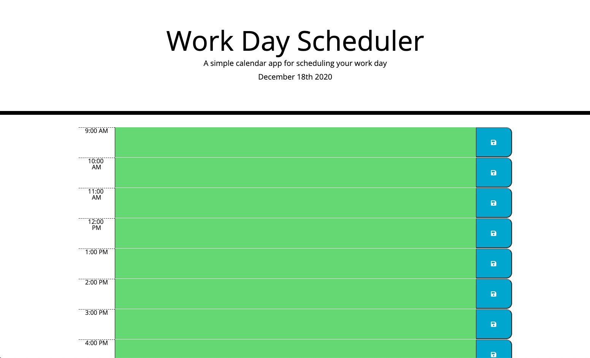

# work-day-scheduler

## Description
A simple workday scheduler

## Installation
- [Clone this repo](https://github.com/brhestir/work-day-scheduler.git)
- Push to GitHub
- Serve main branch via GitHub Pages.

## Usage
View the site at [Horiseon](https://brhestir.github.io/work-day-scheduler/)

## Credits
- Refactored from gt-atl-fsf-ft-11-2020-u-c

## Licence
MIT